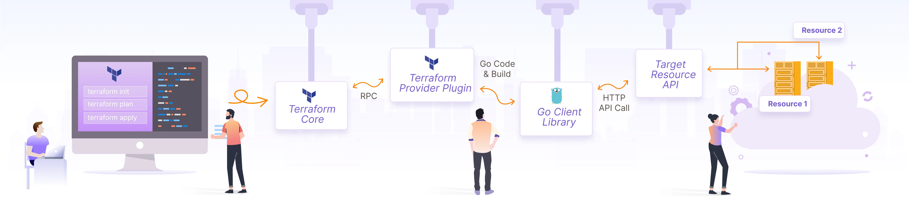
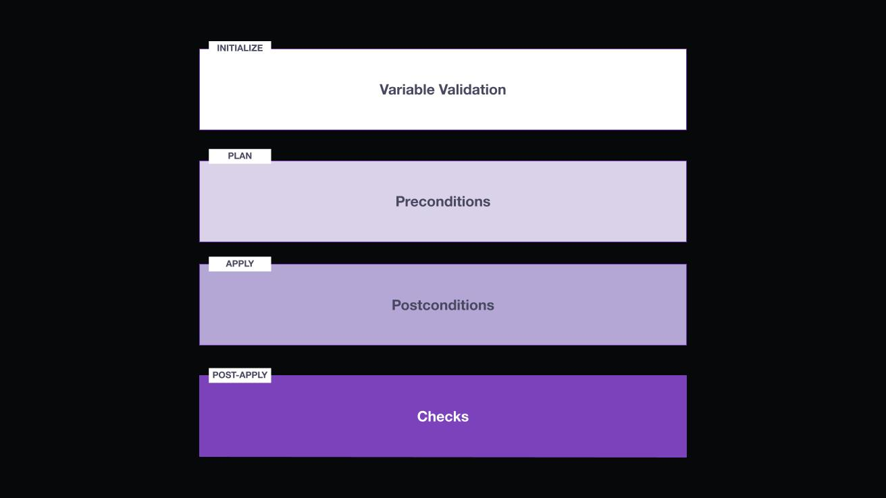

# Part 1-a (Infrastructure as Code (IaC) with Terraform)✅
## What is Terraform?
- It's Hashicorp Infra as code tool.
- Terraform manages resources on cloud and  services through their (APIs).
- Terraform is logically split into two main parts:
    1. `Terraform Core`: This is the Terraform binary that communicates with plugins to manage infrastructure resources.
    2. `Terraform Plugins`: executable binaries written in ***Go*** that communicate with Terraform Core over an ***RPC interface.***

<div style="text-align: center;">

</div>

## Infrastructure Lifecycle ***`Day 0 / Day 1+`***:
- `Day 0` : code provisions and configures your initial infra.
- `Day 1+` : refers to OS and app config you apply after you’ve initially built your infra.

## What Terraform Do
- `Refresh`: reconcile what terraform thinks the real world looks like
- `plan`: plan for design config
- `apply / destroy`: create/destroy the actual planned infra 

# Part 1-b (Terraform fundamentals)✅
## Providers
- Plugins called providers to interact with cloud providers, SaaS providers, and other APIs
- Each provider adds a set of resource types & data sources that Terraform can manage.
- Come from Terraform Registry or custom locals ones.

## Versions
- `required_providers` for provider versions.
- `required_version` for  controlling which Terraform CLI version is allowed to run your code. 

# Part 2 (Core Terraform workflow)✅
## Core Terraform Workflow
1. Write - Author infrastructure as code.
2. Initialize - prepares your workspace so Terraform can apply your configuration.
3. Plan - Preview changes before applying.
4. Apply - Provision reproducible infrastructure.

- Work As A Team:
  - write in a branch → review a plan → apply after approval.
  - the core workflow for teams is `a loop that plays out for each change`.

## terraform main Commands
### `init`
- `3` main tasks it does:
  1. Backend Initialization (*remote/local*)
  2. Provider Plugin Installation: (*update/install*) && (Lock_file)
  3. Module Installation: (*update/install*)

- `Flags`
```bash
terraform init -upgrade -reconfigure      # Force Upgrades providers & modules Re-initializes the backend and ignores existing settings
terraform init -migrate-state             # it migrate state to new backend config
```
### `validate`
- a local, fast syntax and logic checker for your Terraform code.

### `graph`
- turns your infrastructure into a visual map

### `plan`

| Flag                | Description                                  | Example                                   |
| ------------------- | -------------------------------------------- | ----------------------------------------- |
| `-out=FILE`         | Save the plan to a file for later apply.     | `terraform plan -out=tfplan`              |
| `-var="key=value"`  | Pass variable directly from CLI.             | `terraform plan -var="env=dev"`           |
| `-var-file=FILE`    | Load variables from a file.                  | `terraform plan -var-file=dev.tfvars`     |
| `-target=RESOURCE`  | Plan only for a specific resource.           | `terraform plan -target=aws_instance.web` |
| `-refresh=false`    | Skip refreshing real infrastructure state.   | `terraform plan -refresh=false`           |
| `-destroy`          | Show a plan that will destroy all resources. | `terraform plan -destroy`                 |
| `-compact-warnings` | Shorter warning messages.                    | `terraform plan -compact-warnings`        |
| `-parallelism=N`    | Limit parallelism during refresh.            | `terraform plan -parallelism=5`           |

### `apply`
```bash
terraform apply -var="region=us-east-1" -var="env=prod"
terraform apply -var-file="prod.tfvars"
terraform apply -replace="aws_instance.my_server"
terraform apply -target="aws_s3_bucket.my_bucket"
terraform apply -input=false -auto-approve       
```

### `destroy`
```bash
terraform destroy
terraform apply -destroy
```

### `fmt`
| Flag           | What it Does                                                            |
| -------------- | ----------------------------------------------------------------------- |
| `-recursive`   | Format files in **subdirectories** too.                                 |
| `-check`       | **Check** if files are already formatted (exit 0 if yes). Useful in CI. |
| `-diff`        | Show **differences** without changing files.                            |
| `-write=false` | Don’t overwrite files (implied with `-check`).                          |
| `-list=false`  | Don’t list files with formatting issues.                                |


# Part 3 (Terraform configuration)✅

| Item                              | `init` | `plan` | `apply` |
| --------------------------------- | ------ | ------ | ------- |
| Provider config                   | ✅      | ✅      | ✅       |
| Backend config                    | ✅      | ✅      | ✅       |
| Module sources                    | ✅      | ✅      | ✅       |
| Variables                         | ❌      | ✅      | ✅       |
| Locals                            | ❌      | ✅      | ✅       |
| `for_each` / `count` collections  | ❌      | ✅      | ✅       |
| Resource arguments (from vars)    | ❌      | ✅      | ✅       |
| Apply-time attributes (IDs, ARNs) | ❌      | ❌      | ✅       |
| Outputs using computed values     | ❌      | ❌      | ✅       |

- The critical rule:
👉 Anything that determines structure — like how many resources, or their names — must be known before plan.

## 

## Variables
```hcl
variable "<LABEL>" {
  type        = TYPE
  default     = <DEFAULT_VALUE>
  description = "<DESCRIPTION>"
  sensitive   = <true|false>
  nullable    = <true|false>
  ephemeral   = <true|false>

  validation {
    condition     = <EXPRESSION>
    error_message = "<ERROR_MESSAGE>"
  }
}
```
- The ephemeral argument is useful for values that only exist temporarily, such as a short-lived token or session identifier.
- The sensitive argument prevents Terraform from showing a variable block's value in CLI output when you use that variable in your configuration.

## Validation
- Terraform offers several ways of validating configuration:

### input variable validation
- `Input variable` validations verify your ***configuration's parameters*** when Terraform creates a plan.
1. Verify input variables meet specific format requirements.
2. Verify input values fall within acceptable ranges.
3. Prevent Terraform operations if a variable is misconfigured.

```hcl
variable "image_id" {
  type        = string
  description = "The id of the machine image (AMI) to use for the server."

  validation {
    condition     = length(var.image_id) > 4 && substr(var.image_id, 0, 4) == "ami-"
    error_message = "The image_id value must be a valid AMI id, starting with \"ami-\"."
  }
}
```

### preconditions and postconditions
- Preconditions ensure individual `resources, data sources, and outputs` meet your requirements before Terraform tries to create them.
  - verify your ***configuration's assumptions*** for resources, data sources, and outputs before Terraform creates them
- Postconditions verifies that Terraform produced your `resources and data sources` with the expected and desired settings.
  - serve as static guardrails to enforce mandatory configuration aspects on your data and resource blocks. 
```hcl 
output "instance_public_ip" {
  value = aws_instance.web.public_ip

  precondition {
    condition     = length([for rule in aws_security_group.web.ingress : rule if rule.to_port == 80 || rule.to_port == 443]) > 0
    error_message = "Security group must allow HTTP (port 80) or HTTPS (port 443) traffic."
  }
}

data "aws_ami" "example" {
  id = var.aws_ami_id

  lifecycle {
    # The AMI ID must refer to an existing AMI that has the tag "nomad-server".
    postcondition {
      condition     = self.tags["Component"] == "nomad-server"
      error_message = "tags[\"Component\"] must be \"nomad-server\"."
    }
  }
}

```

> ####  To decide between a precondition or a postcondition, consider whether the rule you are setting represents:
- an assumption you need to make about the configuration
  - Use preconditions for assumptions that you want to verify before Terraform creates the target block.
- or a guarantee on the resulting resource, and when it should run. 
  - Use postconditions for guarantees that you need to verify after Terraform creates the resource or reads from the data source

###  check blocks
- Use the check block to validate your infrastructure outside of the typical resource lifecycle. 
- When a check block's assertion fails, Terraform reports a warning and continues executing the current operation.
  - Validate resources, data sources, variables, or outputs in your configuration.
  - Validate the behavior of your infrastructure as a whole.
  - Verify infrastructure configuration without blocking operations.

```hcl
check "health_check" {
  data "http" "terraform_io" {
    url = "https://www.terraform.io"
  }

  assert {
    condition = data.http.terraform_io.status_code == 200
    error_message = "${data.http.terraform_io.url} returned an unhealthy status code"
  }
}
```
### ***`Order of validation`***
1. Terraform executes input variable validations immediately, before generating a plan.
2. Terraform executes preconditions after generating a plan but before creating the resource, data source, or output.
3. Terraform executes postconditions after planning and applying changes.
4. Terraform executes checks at the end of plan and apply operations and every time health assessments run on a workspace in HCP Terraform.

<div style="text-align: center;">

</div>


## Resources

| Type                            | Syntax                                        |
| ------------------------------- | --------------------------------------------- |
| Resource                        | `resource_type.name`                          |
| Resource attribute              | `resource_type.name.attribute`                |
| Resource with count (index)     | `resource_type.name[0].attribute`             |
| Resource with count (all)       | `resource_type.name[*].attribute`             |
| Resource with for_each (by key) | `resource_type.name["key"].attribute`         |
| Resource with for_each (all)    | `[for r in resource_type.name : r.attribute]` |
| Input variable                  | `var.name`                                    |
| Local value                     | `local.name`                                  |
| Module output                   | `module.module_name.output_name`              |
| Data source                     | `data.data_type.name.attribute`               |
| Nested block (list)             | `resource_type.name.block[*].attribute`       |
| Nested block (map by key)       | `resource_type.name.block["key"].attribute`   |
| Path (module)                   | `path.module`                                 |
| Path (root)                     | `path.root`                                   |
| Path (cwd)                      | `path.cwd`                                    |
| Workspace                       | `terraform.workspace`                         |
| Count index                     | `count.index`                                 |
| Each key                        | `each.key`                                    |
| Each value                      | `each.value`                                  |
| Self                            | `self.attribute`                              |
| Values (from map)               | `values(resource_type.name)[*].attribute`     |

## Types
- We have 3 main types:

## 1. Primitive Types
- *Primitive types* : a simple type that isn't made from any other types
- we have 3 primitive types:
  - `string`
  - `number`
  - `bool`

## 2. Collection Types
- *collection type*: a type allows multiple values of one other type to be grouped together as a single value.
- we have 3 collection types:
  - `lists` ( Ordered, indexable, Duplicates allowed)
  - `maps`  ( Key-value pairs, Accessed by key)
  - `sets`  ( Unordered, unique )

- list([ value, value ]):
  - example: **list_ex = ["apple", "banana", "cherry"]**
  - allow duplicate, ordered -> can access specific value: **value[0]**
  - works with ***count & for_each & for*** "order doesn't matter"
  - access:
    - list.index
    - list[index]
    - list["index"]

- set([ unique_value, unique_value ]):
  - example: **set_ex = ["apple", "banana", "cherry"]**
  - unique, no index -> can't access specific value
  - access works with ***for_each & for*** "order doesn't matter"

- map({ KEY = TYPE }):
  - example: **map = {"name" = "kary", "age" = "15"}**
  - keys in a map must be strings & unique
  - key & value by **:** or **=**, element & other by **,** or linespace
  - ***for_each*** -> ***each.key each.value***
  - `dynamic maps` { for key, value in var.my_map : key => upper(value) }
  - access:
    - map.key
    - map[key]
    - map["key"]

## 3. Structural Types
- we have 2 types:
  - `object`
  - `tuple`

- object({ KEY = TYPE })
  - objects like typed maps.
  - Keys must be defined ahead of time
  - You can make certain attributes ***optional(TYPE,default)*** in object definitions
  - access like maps

- tuple([ string, number, bool ])
  - fixed-length collection where each element can be a different type.

## 4. Dynamic Types
- any

## Loops
- `for_each`:
  - Terraform expects either a map or a set (normal)
  - We use it to create multiple resources/data based on a map/set
  - map -> `each.key & each.value`
  - set -> `each.key || each.value`


# Part 4-a (Terraform modules) ✅

# Part 4-b (Terraform state management)✅
## Refactor Terraform state:
- when we reorganize our resources like moving ownership or split big project

- We should group the resources based on:
  1. rate of change
  2. stateless/stateful
  3. Access and team responsibility

## Migrate resources
- Steps:
  1. take backup of state
  2. remove from state use **removed // state rm**
  3. add to the now state using **import**
- we can use script that we define what to import and what to remove then we `apply`
```hcl
resource "aws_instance" "example" {
    instance_type = "t3.micro"
    ami = data.aws_ami.example.id
}
removed {
  from = aws_instance.example
  lifecycle {
    destroy = false
  }
}
import {
id = "i-07b510cff5f79af00"
to = aws_instance.example
}
moved {
    from = <old address for the resource>
    to = <new address for the resource>
}

```
- We also can se commands only 
```bash
terraform state rm <resources.id>
terraform import <resources> <id>
```
- Other method (**Dangerous**)
  - pull the state from project-old/project-new
  - use state mv -state -state-out
  - push the state to project-old/project-new

```bash
terraform state pull > source.tfstate
terraform state pull > destination.tfstate
terraform state mv -state source/source.tfstate -state-out destination/destination.tfstate aws_instance.example aws_instance.example
terraform state push source.tfstate
terraform state push destination.tfstate
```

# Part 5 (Maintain infrastructure with Terraform)✅
## Import
- we can import into:
  - resources 
  - modules 
  - resources configured with count/for_each
```bash
terraform import aws_instance.foo i-abcd1234
terraform import module.foo.aws_instance.bar i-abcd1234
terraform import 'aws_instance.baz[0]' i-abcd1234
terraform import 'aws_instance.baz["example"]' i-abcd1234
```

## Import order
### Method 1
1. create a place holder config 
2. run import command 
3. Inspect the imported state ( to see the real attributes)
4. update your config to match your desire config (existing/updating)
5. run plan (no wanted changes -> show noting to plan/ updating -> show plan to be applied  )

### Method 2
1. create import block
2. (Optional) Generate the config
3. plan then apply

```hcl
import {
  to = docker_container.web
  id = "abcd1234"
}
```
```bash
terraform plan -generate-config-out=generated.tf
```

## Logs

| Variable              | Purpose                                           | Example                    |
| --------------------- | ------------------------------------------------- | ---------------------------|
| **`TF_LOG`**          | Enables global logging (core + providers)         | `TF_LOG=DEBUG`             |
| **`TF_LOG_CORE`**     | Logs only Terraform core engine internals         | `TF_LOG_CORE=TRACE`        |
| **`TF_LOG_PROVIDER`** | Logs only provider plugin activity                | `TF_LOG_PROVIDER=DEBUG`    |
| **`TF_LOG_PATH`**     | Saves logs to a file instead of stdout            | `TF_LOG_PATH=terraform.log`|

# Part 6 (HCP Terraform)
<div style="text-align: center;">

</div>

## HCP Terraform Overview
- HCP Terraform is an application that helps teams use Terraform together.

### Workflow
- HCP Terraform organizes your resources into workspaces, which contain your resource definitions, environment and input variables, and state files.
  - VCS-driven workflow
  - CLI-driven workflow
  - API-driven workflow

- HCP Terraform organizes infrastructure into ***`projects`*** that contain workspaces and Stacks.:
  - `Workspaces` are ideal for managing a self-contained infrastructure of one Terraform root module.
  - `Stacks` are ideal for managing multiple infrastructure modules and repeating that infrastructure at scale.

## HCP Workspaces
- A workspace is a group of infrastructure resources managed by Terraform.
- workspace in HCP act as a container directory for configuration

### HCP Terraform workspaces and local working directories

| Component                   | Local Terraform                | HCP Terraform           |
|-----------------------------|--------------------------------|-------------------------|
| **Terraform configuration** | On disk                        | In VCS Repo             |
| **Variable values**         | As `.tfvars` files, arge , env | In workspace            |
| **State**                   | On disk or in remote backend   | In workspace            |
| **Credentials and secrets** | In shell env or as prompts     | In workspace, stored as sensitive variables  |
| **Runs**                    | on local machine               | remote operations (the default) |

- Workspace Health
  - `Drift detection` determines whether your real-world infrastructure matches your Terraform configuration.
  - `Continuous validation` determines whether custom conditions in the workspace’s configuration continue to pass after Terraform provisions the infrastructure.


## Remote operations
- HCP Terraform is designed as an execution platform for Terraform, and can perform Terraform runs on its own disposable virtual machines.
- HCP execution options:
  - remote 
  - local
  - agent
- `Terraform's features` *rely on remote execution and are not available when using local operations*. This includes features like **Sentinel policy enforcement, cost estimation, and notifications.**
# Notes
## commands
```bash
terraform refresh         # Refresh what terraform sees in real world
terraform apply -refresh-only          # Refresh state with real-world infrastructure
terraform get                          # act as init but only for module update/install
terraform apply -replace=<resource>    # it force destroy and create a resource even not changes  
terraform apply -target=<resource>     # it only target a specific resource & dependancies
```

## cloudinit_config
- `cloudinit_config` is a Terraform ***data source*** (not a resource) that helps you generate and package cloud-init
 user data for virtual machines.
- a Terraform `helper` that simplifies building complex, ***multi-part user_data payloads*** for virtual machines.

| Argument     | Purpose     |
| ------------ | ----------- |
| `gzip`  | (Optional) Compress the final output. Defaults to `false`.|
| `base64_encode` | (Optional) Whether to base64-encode the output (required by some providers like AWS). Defaults to `true`. |
| `part {}`           | One or more configuration parts to include in the final user_data.        |
| `part.content_type` | MIME type for this part (e.g., `text/cloud-config`, `text/x-shellscript`) |
| `part.content`      | The actual script or config content.   |


```hcl
data "cloudinit_config" "web_init" {
  gzip          = false
  base64_encode = true

  part {
    content_type = "text/cloud-config"
    content      = <<-EOC
      #cloud-config
      package_update: true
      packages:
        - nginx
        - curl
    EOC
  }

  part {
    content_type = "text/x-shellscript"
    content      = <<-EOS
      #!/bin/bash
      systemctl enable nginx
      systemctl start nginx
    EOS
  }
}

resource "aws_instance" "web" {
  ami           = "ami-123456"
  instance_type = "t3.micro"

  user_data = data.cloudinit_config.web_init.rendered
}

```

## provisioner

## Expressions
### for a in Bs : a.id
### chomp

## Refactor
https://developer.hashicorp.com/terraform/language/modules/develop/refactoring

## notes
- ephemeral block
- null resources
- flatten & setproduct
## dynamic block
- dynamic block type, which is supported inside resource, data, provider, and provisioner blocks
- used with resource types include repeatable nested blocks in their arguments